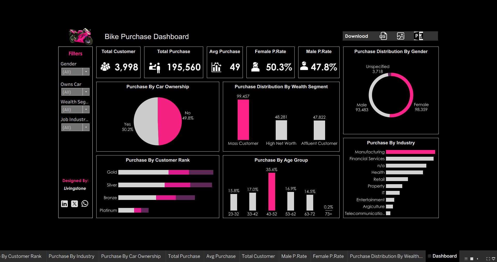

# 📊 Taiwo Adegbola — Data Analyst

---

## 👋 About Me  
Hi there! I’m **Taiwo Adegbola** — a data analyst passionate about using data to drive smarter decisions and create real impact.  
With growing expertise in **SQL, Python, and data visualization**, I enjoy transforming raw datasets into clear, actionable insights that help organizations solve problems, optimize operations, and achieve their goals.

---

## 💼 What I Do

### ✅ Data Analytics & Insights
I analyze data to uncover patterns, trends, and actionable recommendations for:
- Business decision-making
- Operational efficiency
- Strategic growth

### 📊 Data Visualization
I create clear, interactive dashboards and reports to communicate insights effectively to both technical and non-technical audiences.

---

## 📂 My Portfolio  
*A snapshot of projects I’ve worked on and learning exercises I’ve completed:*

---

## 🏢 HR Attrition Dashboard

**Overview:**  
An interactive dashboard providing insights into employee attrition trends across **age groups, performance ratings, salary ranges, satisfaction levels, and job roles** — helping HR teams identify high-turnover areas and take proactive measures.

**Features:**
- Overall attrition rate: **30%**
- Breakdown by age, gender, department, job role
- Salary vs. attrition relationship
- Satisfaction and performance correlations

**Tools Used:**  
- Microsoft Excel (Pivot Tables, Charts)  
- Power BI for interactive visualizations

**Key Insights:**
- Female employees have a higher attrition rate due to salary disparities  
- Poor performance ratings strongly correlate with higher attrition  
- Employees aged **31–35** have the highest attrition rate

---

## 🩺 Cancer Review Dashboard (2025)

**Description:**  
An interactive dashboard designed to monitor and analyze cancer patient data, including tumor stages, patient demographics, and treatment outcomes.

**Tools:** SQL & Tableau  

**Insights Generated:**
- Majority of patients are in **Stage II**
- Death rate can be reduced from **19.76%** to **10.76%** (target)
- Key trends in surgery types and patient outcomes

---

## 📈 Sales Variance Analysis Dashboard (2024)

**Description:**  
A **Power BI dashboard** tracking actual sales vs. targets, enabling real-time business performance monitoring.

**Key Features:**
- Overall and salesperson-level variance analysis  
- Monthly performance trends  
- Interactive filtering by month and salesperson  
- KPI indicators for over/under-performance  
- Professional **dark blue theme** for clarity  

**Technologies:** Power BI, DAX, Data Modelling, Excel & SQL  

**Insights Generated:**
- Identifies top-performing salespeople and their monthly trends  
- Highlights underperformance and missed targets per month  
- Supports management in making **data-driven** decisions

---

## 🚴‍♂️ Bike Purchase Dashboard

**Description:**  
An interactive dashboard visualizing customer demographics and purchase behavior in the bike industry.

**Key Insights:**
- **Purchase Rate:** Female (50.3%) slightly higher than Male (47.8%)  
- **Car Ownership Impact:** Purchases almost evenly split — 50.2% (own car) vs. 49.8% (no car)  
- **Wealth Segments:** Mass customers lead purchases (99,457)  
- **Top Customer Ranks:** Gold and Silver members dominate  
- **Age Group with Highest Purchases:** 43–52 years (35.6%)  
- Industry leaders: **Manufacturing**, **Financial Services**, **Health**  

**Tools:** SQL & Tableau  

---

## 📬 Connect with Me
- **GitHub:** [taiwo-analytics](https://github.com/taiwo-analytics)  
- **LinkedIn:** [Taiwo Adegbola](https://www.linkedin.com/in/taiwo-adegbola-b838b5a7)  
- **Twitter:** [@livingstone0007](https://x.com/livingstone0007)  
- **Email:** livingstone000777@gmail.com  
- **WhatsApp:** [Chat with me](https://wa.me/2348100812877)
